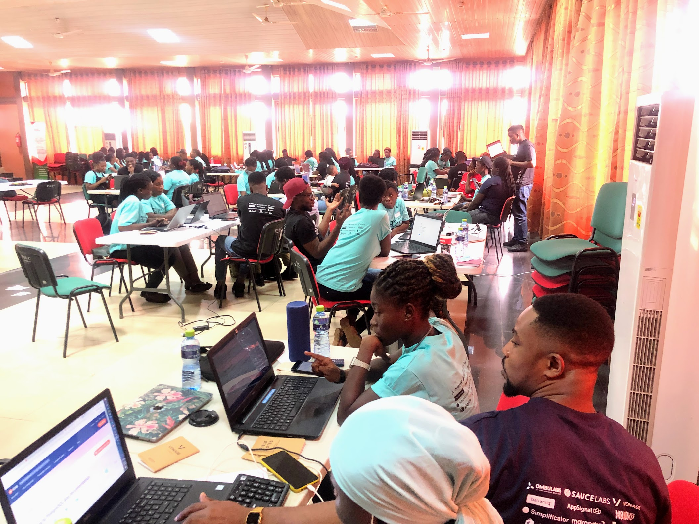
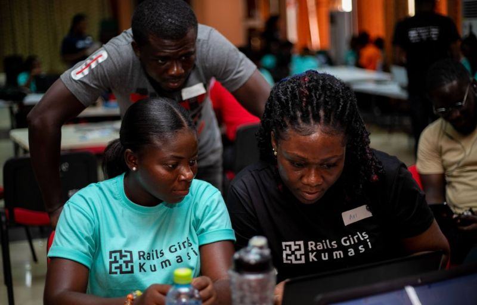
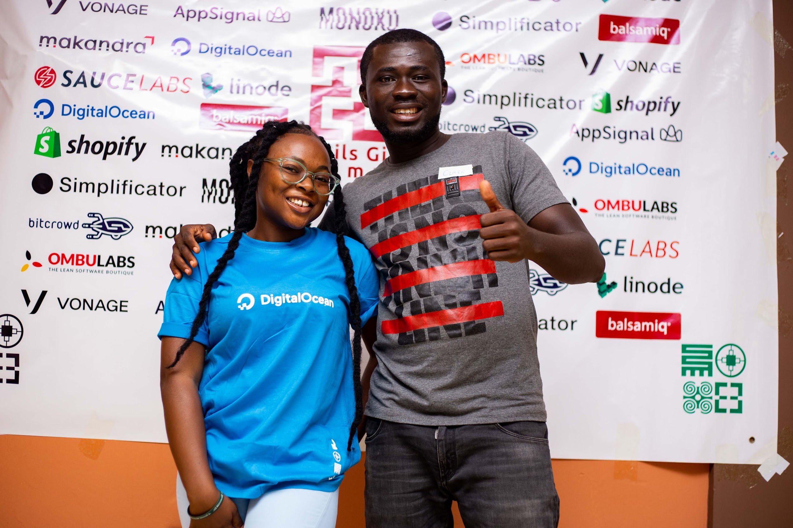
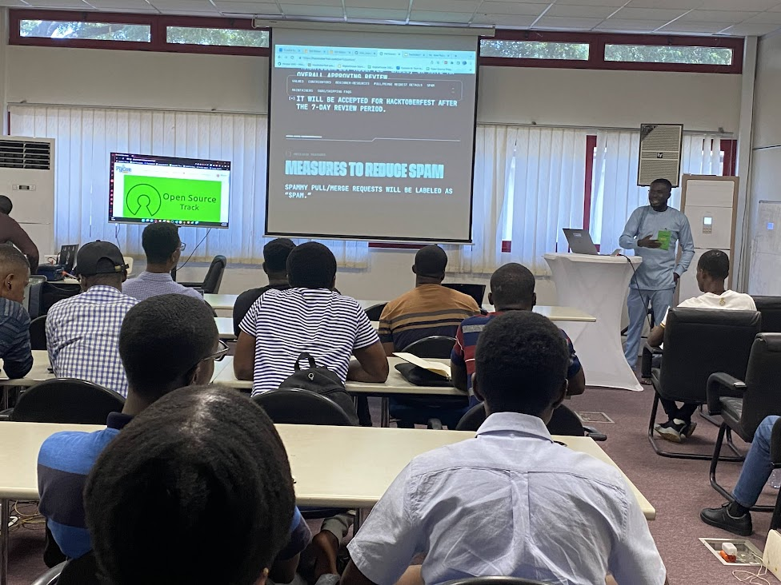
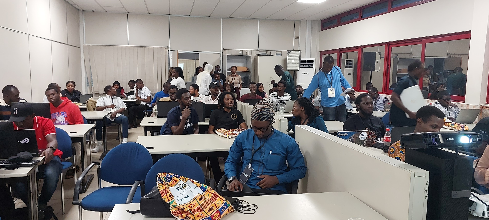
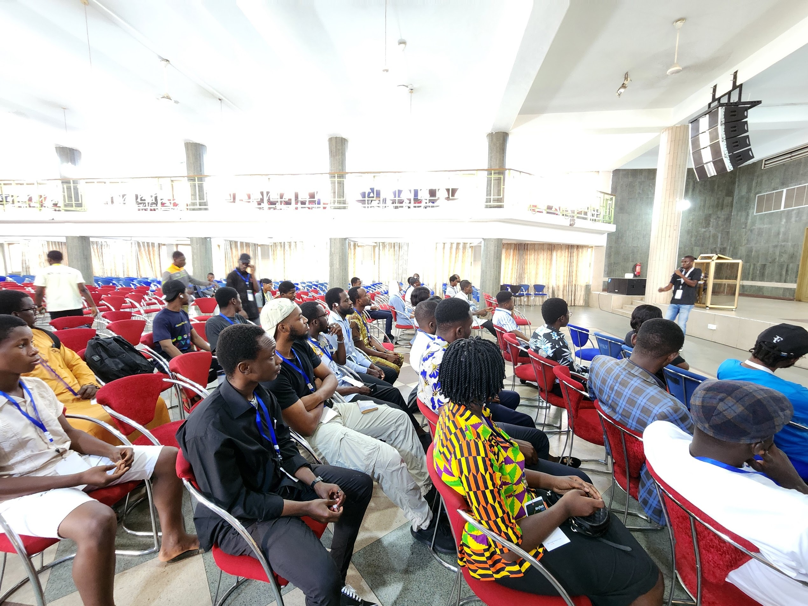
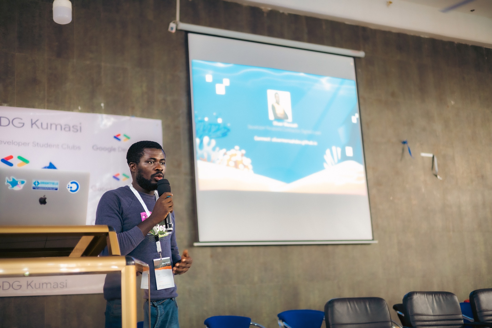
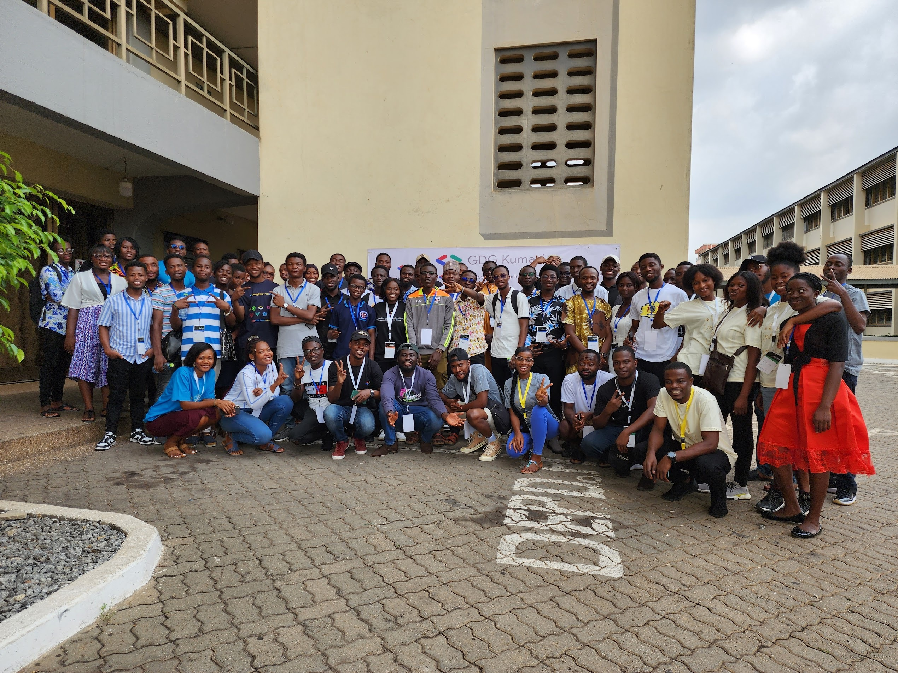

# Events on Events – A 2022 Retrospective of DigitalOcean on Ghana's Developer Communities

2022 was a year with various developer communities in Ghana by either supporting developer events through [DigitalOcean global event sponsorship](https://docs.google.com/forms/d/e/1FAIpQLSct7cckz6so_Bb2onRqxFVfAz5fgpK69hsWWgvxy-wm01KewQ/viewform) or hosting DigitalOcean developer events through [Accra meetup chapter](https://www.meetup.com/digitalocean-accra/) of DigitalOcean global meetups. The event engagement has become more than we imagined possible within the year and as I reflect on 2022 DigitalOcean engagements with Ghana's developer community, I wanted to share accounts of events we hosted and supported, recognize the people who made it possible, and what we could do better in the years ahead.

## DigitalOcean and Rails Girls Kumasi

Rails Girls Kumasi was my first in-person event I attended in Ghana as part of my interest to share about DigitalOcean to the developer communities. On 12th March, 2022, I travelled to Kumasi for this program which brought together many young, ambitious and dedicated ladies interested in getting started with programming and tech professionals. This is a free workshop where these newbies have hands-on experience in computer programming using Ruby on Rails. Together with the program conveners, mentors and speakers, we guided these ladies in installation and setting up their dev environments, creating their application with Ruby on Rails(creating their idea scaffold), using sqlite3 db, git for version control and deploying the application to Heroku and DigitalOcean.

For me it was about the experience of everyone involved and the learnings and the goodies the attendees take back home as well as the opportunity to build networking platform among participants after the event. 

DigitalOcean being part of the sponsors, I was given the opportunity to share about DigitalOcean. And that was a good time to educate the attendees on our cloud solutions, what make us stand out from other cloud providers and how they could build on DigitalOcean. 

## DigitalOcean Accra's Inaugural Meetup

I have engaged with DigitalOcean in Ghana's developer events in one way or the other when I was leading Facebook Developer Circles Accra(DevCAccra). DigitalOcean sponsored the first hackathon I hosted a community leader for DevCAccra and also got to engage with the DigitalOcean team when they visited Ghana for the first time in 2019. So I 
couldn't have been proud of ny if I didn't launch a DigitalOcean meetup chapter in Ghana. 

Together with DigitalOcean Navigator in Ghana,[Rexford Nkansah](https://www.linkedin.com/in/khophi/), we started the Accra chapter to bring together local tech professionals of all skill levels to share resources, learn, and form discussions around cloud and DevOps topics including configuration management, containers, databases, monitoring, virtualization, scalability, performance, and more. 

To officially launch this meetup, we hosted our inaugural meetup on 20th August, 2022 which brought together about 50 local tech professionals. 

I led a great introduction to the DigitalOcean community, cloud services and a technical walkthrough of building JAMstack application using DigitalOcean managed Databases, Spaces, App platform and Serverless Function. Rexford also gave a talk on Kubernetes while [Clemence Sedem Agozi](https://www.linkedin.com/in/efocoder/) gave a deep dive into cloud security. Below is the recorded video available on Youtube.

By end of our meetup, many developers were left inspired to explore DigitalOcean cloud solutions and as techies love swags, so we gave out many swags; t-shirts, stickers, hoodies.

## DigitalOcean at Pycon Ghana 2022

[Pycon Ghana](https://gh.pycon.org/) is an annual community conference convene by Python Ghana. The 2022 edition was a 3-day conference with a lot of talks, workshops and many fun activities. 

DigitalOcean was privilege to be part of the sponsors of the open source track and also as the conference was hosted in October, it was a great opportunity to celebrate hacktoberfest. Rexford Nkansah and I shared with the participants about opensource contributions through the lens of hacktoberfest and DigitalOcean navigators program.

And the conference ended with an opensource sprint where participants were actively contributing to open source as part of hacktoberfest contributions. It was a night of fun and I was overjoyed to see folks passionately looking for projects they would contribute to. Since I work more with PHP, I selected PHPMyAdmin to contribute to.

## A revisit to Kumasi for DevFest Kumasi

After organizing the maiden DigitalOcean meetup for techies in Accra, Rexford and I planned to let DigitalOcean in-person event touch many corners of Ghana with budding tech ecosystem. So Kumasi was our next stop for such event and we thought of organizing that before the year ends. When I later came across DevFest Kumasi was about to be hosted, it was a good time to support and collaborate on the event as we all in this ecosystem together for nuturing of talents, and supporting each other's career journey.

On Saturday, 21st December, 2022, I travelled about 3hours by bus to Kumasi from Sefwi Bekwai and Rexford also got to Kumasi from Koforidua within 5hours. I got to the event venue earlier and within some minutes, Rexford was there, handed off the swags to me and I was able to set up a booth with so many swags for the participants. Immediately, after the boot set up, many attendees came around asking if we are selling them? After mentioning, we are here because of them, the excitements on their faces shows that the tech events really need such collaborations. 

I also had a speaking engagement with the participants on exploring DigitalOcean cloud for their startups and buiding personal projects and in doing so they could inspire their teams to adopt our solutions.

## In Conclusion

Thanks to the tremendous efforts of our Global Sponsorships Program and Hacktoberfest, 2022 gave all of us reason to contribute to Ghana's developer community. We appreciate the innovation and hardwork from all the event organizers helping grow Ghana's developer community and we know in 2023, we would engage more often through these programs. 

